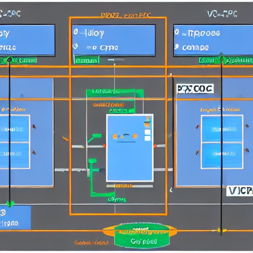

# Infrastructure for AI-Ticulate

## Prerequisites
- AWS CLI https://docs.aws.amazon.com/cli/latest/userguide/getting-started-quickstart.html
- AWS CDK https://docs.aws.amazon.com/cdk/latest/guide/getting_started.html
- Docker https://docs.docker.com/get-docker/
- Docker Compose https://docs.docker.com/compose/install/

## Infrastructure overview

#### AWS
- VPC public subnet 
- EC2 Instance with docker and docker-compose installed
#### Docker hub
- Repository https://hub.docker.com/repository/docker/kyledeveloper321306/ai-ticulate/general

### Structure
A VPC hosting a EC2 instance which has a public route to a containerized nginx reverse proxy which servers a React client and a express api accessing OpenAI api for chat generative completion. 

## Deploying the infrastructure
### Running the CDK
- Must have the AWS CLI installed and configured with credentials

- Configure AWS CLI
```bash
  aws configure
```
- Deploy the CDK
```bash
cd infrastructure/cdk
npm install
cdk deploy
```

### Setting up the EC2 instance
- SSH into the EC2 instance
```bash
ssh -i "ai-ticulate.pem" ubuntu@{ec2-instance-public-ip}
```

### Install Dependencies on EC2 instance
##### Installing Docker on EC2 Ubuntu
```bash
sudo apt-get update
sudo apt-get install ca-certificates curl gnupg
sudo install -m 0755 -d /etc/apt/keyrings
curl -fsSL https://download.docker.com/linux/ubuntu/gpg | sudo gpg --dearmor -o /etc/apt/keyrings/docker.gpg
sudo chmod a+r /etc/apt/keyrings/docker.gpg
sudo apt-get update
sudo apt-get install docker-ce docker-ce-cli containerd.io docker-buildx-plugin docker-compose-plugin
sudo docker run hello-world # test docker
```
##### Login to Docker Hub
```bash
sudo docker login -u kyleheat #password can be found in DOCKER_PASSWORD in .env.example
```
## Pull the projects docker images
```bash
sudo docker pull kyleheat/ai-ticulate --all-tags
```
## Install docker-compose
```bash
sudo curl -L "https://github.com/docker/compose/releases/download/1.29.2/docker-compose-$(uname -s)-$(uname -m)" -o /usr/local/bin/docker-compose
sudo chmod +x /usr/local/bin/docker-compose
docker-compose --version # test docker-compose
```
## Create docker-compose.yaml
```bash
sudo apt install micro
micro docker-compose.yaml #copy contents of docker-compose.yaml from github
```
## Run docker-compose
```bash
sudo docker-compose up -d
```
## Stop docker-compose
```bash
sudo docker-compose down
```

## Generating Docker image
#### Building the docker images
```bash
docker build --platform linux/amd64 -t kyleheat/ai-ticulate:{tag}
```
#### Pushing the docker images
```bash
docker push kyleheat/ai-ticulate:{tag}
```
